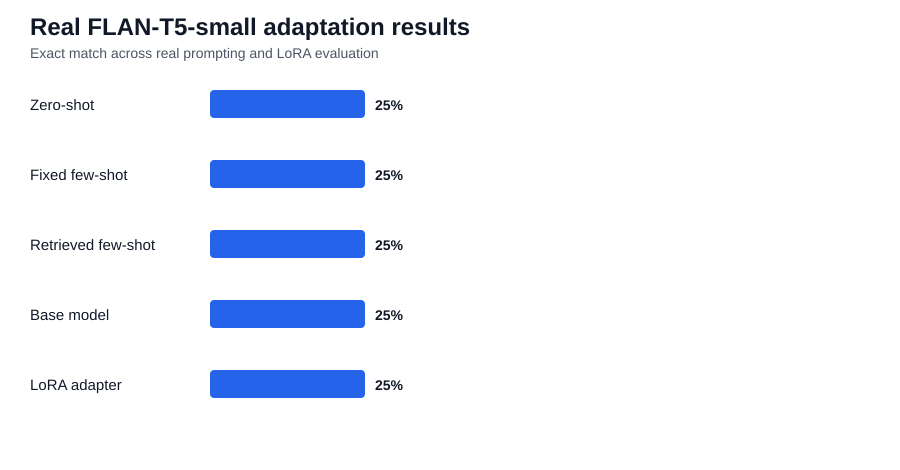

# AM2-04 — LLM Adaptation and LoRA Fine-Tuning Benchmark

A comparative open-source language-model adaptation project:

**zero-shot → fixed few-shot → retrieval-assisted few-shot → LoRA fine-tuning**

## Research question

> When is prompt engineering sufficient, when does retrieval help, and when does parameter-efficient fine-tuning provide measurable additional value?

## Experiment status

- ✅ CI passing
- ✅ Deterministic prompting pipeline executed
- ✅ Real FLAN-T5-small prompting executed
- ✅ Real SentenceTransformer retrieval executed
- ✅ LoRA adapter training executed
- ✅ Base-vs-adapter evaluation executed
- ✅ Training metrics committed

## Key results

### Real FLAN-T5-small prompting

| Strategy | Exact match | Token F1 |
|---|---:|---:|
| Zero-shot | 0.25 | 0.25 |
| Fixed few-shot | 0.25 | 0.25 |
| Retrieved few-shot | 0.25 | 0.25 |

### Base model vs LoRA

| Model | Exact match | Token F1 |
|---|---:|---:|
| Base FLAN-T5-small | 0.25 | 0.25 |
| LoRA adapter | 0.25 | 0.25 |



## LoRA parameter efficiency

| Metric | Result |
|---|---:|
| Base model | `google/flan-t5-small` |
| Total parameters | **77,305,216** |
| Trainable parameters | **344,064** |
| Trainable percentage | **0.4451%** |
| Training loss | **2.9598** |

Only about **0.45%** of the model parameters were trainable, demonstrating the parameter-efficiency objective of LoRA.

## What the experiment shows

The real base model struggled with the deliberately strict instruction-following fixture. For example:

- expected `decrease` → model returned `increase`
- expected `5` → model returned `Two plus three.`
- expected `batteries` → model returned a longer definition rather than the requested plural

LoRA training completed successfully and changed at least one generated response, but aggregate exact match remained at **25%**.

That is an important experimental result: **parameter-efficient fine-tuning does not guarantee improved task performance**. The training fixture is extremely small, so the correct conclusion is that the LoRA mechanism worked technically, while the data was insufficient to justify a claim of behavioural improvement.

## Implemented evidence

- zero-shot prompting
- fixed few-shot prompting
- semantic demonstration retrieval
- retrieval-assisted prompting
- LoRA / PEFT configuration
- adapter training
- base-vs-adapter evaluation
- trainable-parameter analysis
- robustness/error analysis
- experiment tracking
- training-data governance
- model card
- deployment/MLOps design

## Reproduce the experiment

CI-safe path:

```bash
pip install -e ".[dev]"
python scripts/run_prompting_baseline.py
python scripts/run_retrieval_prompting.py
pytest
```

Real prompting/retrieval:

```bash
pip install -e ".[llm,retrieval]"
python scripts/run_real_prompting.py
```

LoRA training and evaluation:

```bash
pip install -e ".[finetune]"
python scripts/train_lora.py
python scripts/evaluate_lora.py
python scripts/finalise_project.py
```

## Evidence

- [Full experiment summary](evidence/RESULTS.md)
- [Final execution-state summary](evidence/final_project_summary.json)
- [LoRA training metrics](evidence/lora_training_metrics.json)
- [Real prompting outputs](evidence/tables/phase2_real_prompting.csv)
- [Base-vs-LoRA outputs](evidence/tables/phase3_base_vs_lora.csv)
- [Error summary](evidence/tables/phase4_error_summary.csv)
- [How to run the real experiment](docs/running_real_experiment.md)

## Documentation

See `docs/` for prompt/retrieval methodology, LoRA methodology, governance, model card, deployment/MLOps, final reflection and AM2 evidence.

## Responsible use

The bundled training and evaluation fixture is intentionally tiny. These results demonstrate the engineering workflow and parameter-efficiency mechanism, not general LLM quality or production safety.

## Licence

Code: MIT. External models/datasets retain their original licences.
